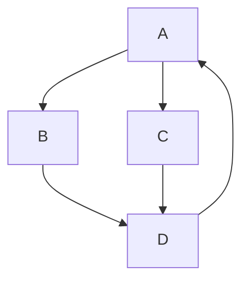

## Graphs

Graph representations.
DFS (forest): cycle or lexicographic order. BFS: shortest path, Dijkstra & Prim. Floyd/Warshall on adjacency matrix. PERT charts. Call tree, series-parallel graph (for scheduling).

